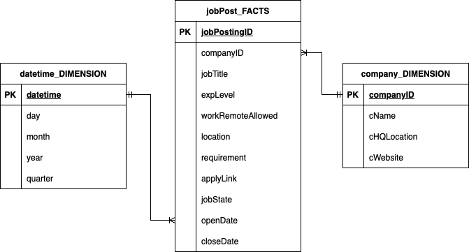

# LINKEDIN-POST-TRACKING
Author: Aaron Nguyen
---
### Table of content
- [LINKEDIN-POST-TRACKING](#linkedin-post-tracking)
  - [Table of content](#table-of-content)
  - [1. Tech Stack](#1-tech-stack)
  - [2. Scope](#2-scope)
    - [2.1 In-scope](#21-in-scope)
    - [2.2 Out-scope](#22-out-scope)
  - [3. Design Specification](#3-design-specification)
    - [3.1 Folder Structure](#31-folder-structure)
    - [3.2 Configuration Options](#32-configuration-options)
    - [3.3 Data Model](#33-data-model)
    - [3.4 Architecture Diagram](#34-architecture-diagram)
    - [3.5 Report Structure](#35-report-structure)
  - [4. Set up](#4-set-up)
    <!-- - [4.1 PostgreSQL database setup](#41-postgresql-database-setup)
      - [4.1.1 PostgreSQL packages](#411-postgresql-packages)
      - [4.1.2 pgAdmin](#412-pgadmin)
      - [4.1.3 Create an empty database](#413-create-an-empty-database)
      - [4.1.4 Restore the SQL file to the empty database](#414-restore-the-sql-file-to-the-empty-database)
    - [4.2 Python environment](#42-python-environment) -->
  - [5. Run](#5-run)

---

### 1. Tech Stack
- Python
- SQL
- MySQL database (set up locally)


### 3. Design Specification

#### 3.1 Folder Structure


<!-- .venv # virtual environment  -->
```
images # images used for README
    |_ *.png
    |_ *.jpg
lib
    |_ __init__.py 
    |_ clsAbstractDB.py 
    |_ clsMySQLDB.py 
    |_ utils.py 
logs
    |_ *.log 
sql_scripts
    |_ procedures
    |_ tables
    |_ views
src
    |_ services
        |_ __init__.py 
    |_main.py 
.env # local credentials to access the database
.gitignore
.config.yml # configuration file
README.md
```

#### 3.2 Architecture Diagram


